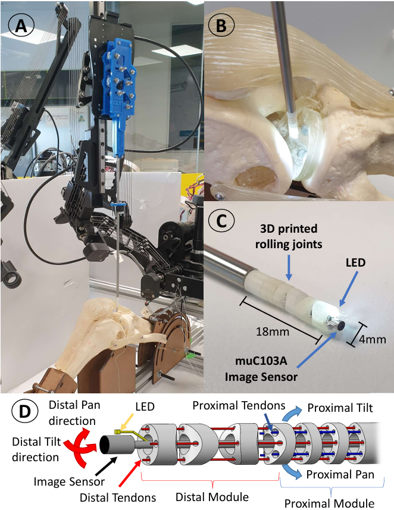
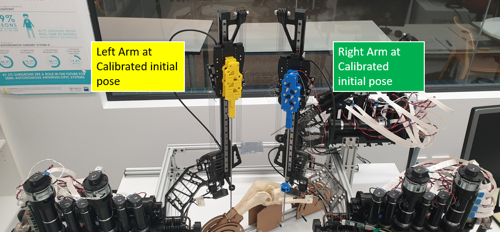
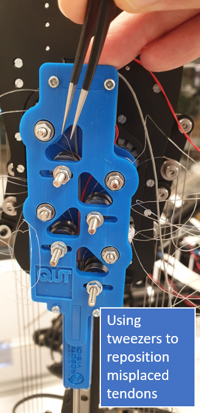
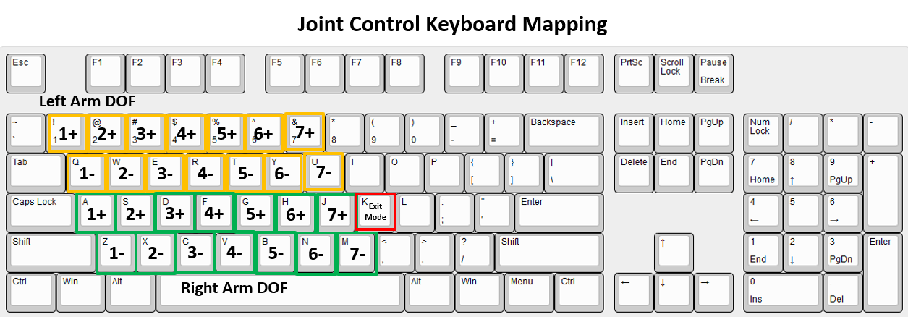
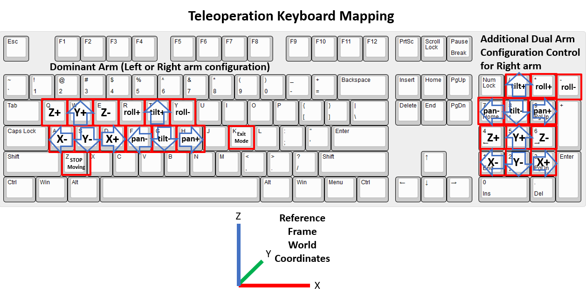
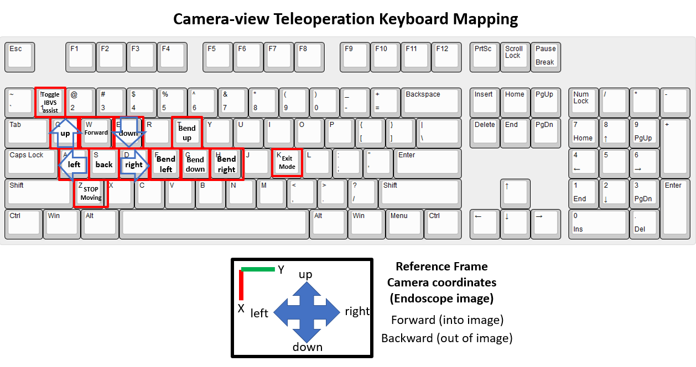

# SnakeRaven

A tendon-driven, 3D-printed snake-like continuum instrument for the RAVEN II surgical research robot, with the real-time control and vision software that drives it.

SnakeRaven mounts on the RAVEN II tool holder in place of a standard instrument. This repository is the fully integrated system as it stood at the end of my PhD: dual-arm teleoperation, an endoscopic vision system with hand-eye calibration, image-based visual servoing (IBVS) that assists the operator by holding the target in view, and autonomous waypoint navigation.


*from our T-Mech 2024 paper*

*A. SnakeRaven - a 3D printed steerable arthroscope attached to the RAVEN II telerobotic system. B. the end-effector and its illumination inside a phantom knee C. a close-up view of the end-effector and camera sensor D. a diagram of the end-effector structure with the integrated camera, distal components in red and proximal components in blue*

<!-- This is the hero image from snake_raven_controller. Copy the file into this
     repo's images/ folder. It is the single most valuable image in the network —
     it shows what the thing physically is, in one glance, which no amount of prose
     does. -->


**Status:** archived. Completed March 2023 and not actively maintained. Built for ROS Kinetic against RAVEN II release 18_05. The methods are described in full in the papers and thesis below.

## Papers

The design, kinematics and control implemented here are published in:

> A. Razjigaev, A. K. Pandey, D. Howard, J. Roberts and L. Wu, "SnakeRaven: Teleoperation of a 3D Printed Snake-like Manipulator Integrated to the RAVEN II Surgical Robot," *2021 IEEE/RSJ International Conference on Intelligent Robots and Systems (IROS)*, 2021, pp. 5282–5288. [doi:10.1109/IROS51168.2021.9636878](https://doi.org/10.1109/IROS51168.2021.9636878)

> A. Razjigaev, A. K. Pandey, D. Howard, J. Roberts, A. Jaiprakash, R. Crawford and L. Wu, "Optimal Vision-Based Orientation Steering Control for a 3-D Printed Dexterous Snake-Like Manipulator to Assist Teleoperation," *IEEE/ASME Transactions on Mechatronics*, vol. 29, no. 2, pp. 1260–1271, 2024. [doi:10.1109/TMECH.2023.3300662](https://doi.org/10.1109/TMECH.2023.3300662)

Full method and derivations: [PhD thesis](https://eprints.qut.edu.au/235042/).

## See it working

- [Introduction to SnakeRaven](https://www.youtube.com/watch?v=S8Rw0hFhcuw)
- [Assembly walkthrough](https://www.youtube.com/watch?v=k744cxB5OMc)
- [Demo videos](https://www.youtube.com/channel/UCiLKwfcym1r7Ru3fDSA_D_A)
- [CAD files on GrabCAD](https://grabcad.com/library/snakeraven-1)

Parts list, CAD and build instructions for making your own SnakeRaven are in the appendix of the thesis.

## How the system fits together

Four ROS nodes. The controller owns all user interaction; the vision node turns camera frames into a control action; the RAVEN II software does the actual joint servoing.

```
      keyboard
         │
         ▼
  snake_raven_controller ──/raven_jointmove──▶  r2_control  ──▶ RAVEN II
   (talkersnakeraven)   ◀──/joint_states─────   (raven_2)
         ▲
         │ control action
  vision_system_snakeraven ◀── /cv_camera/image_raw ── endoscope
      (imageprocessor)
```

Joint deltas go out on `/raven_jointmove` at 1000 Hz; joint feedback arrives on `/joint_states` from `raven_state.msg` at 1000 Hz.

Inside the controller, a ROS thread handles publish/subscribe and a console thread handles user input, so the menu stays responsive while the control loop runs. The kinematics live in their own class, separate from both.

## What is in here

| Package | What it does |
| --- | --- |
| `snake_raven_controller` | Kinematics and control. Forward/inverse kinematics for the multi-module continuum section, teleoperation modes, waypoint tasks, keyboard interaction. |
| `vision_system_snakeraven` | Endoscopic camera processing, ArUco detection, hand-eye calibration, and the IBVS control action. |
| `raven_2` | Modified files for the RAVEN II control software. Replaces `/src`, `/msg`, `/include` in an existing RAVEN II install. |
| `raven_qut_training_docs_2018` | Original QUT RAVEN II training material — kinematics report, history, CAD. Dated but the kinematics report is still useful. |

### Source map

Where to look in `snake_raven_controller/src`:

| File | What it holds |
| --- | --- |
| `talker.cpp` | `main`. Instantiates the controller class. |
| `Raven_Controller.cpp` / `.h` | Console interaction, mode selection, and the two threads. |
| `SnakeRaven.cpp` / `.h` | The kinematics — forward, inverse, and the continuum-section geometry. |
| `Keyboard_interactions.cpp` | Every key mapping in one place. |
| `Waypoint_Task_process.cpp` | Waypoint definitions for the autonomous mode. |
| `listener.cpp` | A stand-in for the real RAVEN II node, for testing without the robot. |

### What was changed in raven_2, and why

The RAVEN II software drives the tool centre point. SnakeRaven's continuum section has more joints than a standard instrument and needs them commanded individually, so `raven_2` gains a **velocity joint control mode** that accepts incremental joint updates over a ROS topic. That mode is the reason this repository ships modified RAVEN II files at all.

Installing SnakeRaven means replacing `/src`, `/msg` and `/include` in an existing `raven_2`. These are the changes that matter:

| File | Change |
| --- | --- |
| `src/local_io.cpp` | Adds the `JointState` publisher and the `raven_jointmove` subscriber. |
| `src/rt_raven.cpp` | Adds the new control mode, `raven_joint_velocity_control`. |
| `src/trajectory.cpp` | `update_joint_position_trajectory` applies the incoming deltas to the desired joint position. |
| `include/raven/defines.h` | `#define RICKS_TOOLS` (line 45) skips tool initialisation. |
| `msg/raven_jointmove.msg` | The joint-delta message itself. |

**Keep a backup of the original RAVEN II code before overwriting.**

### Superseded repositories

This repository is the synthesis of two earlier packages of mine — [`snake_raven_controller`](https://github.com/Andrew-Raz-ACRV/snake_raven_controller) (the original controller and the `raven_2` modifications) and [`vision_servo_control_snakeraven`](https://github.com/Andrew-Raz-ACRV/vision_servo_control_snakeraven) (where the vision-based steering was first implemented). Both are archived. **Start here rather than there.**

MATLAB simulations of the same methods, which run without any hardware: [controller simulation](https://github.com/Andrew-Raz-ACRV/SnakeRavenSimulation) and [IBVS teleoperation simulation](https://github.com/Andrew-Raz-ACRV/SnakeRaven_IBVS_simulation).

Electromagnetic tracking used to validate the kinematics: [`ndi_tracker_project`](https://github.com/Andrew-Raz-ACRV/ndi_tracker_project).

## What runs without a RAVEN II

Very little of this repository does. The control and vision nodes assume a RAVEN II and a physical SnakeRaven instrument.

Two options if you do not have the hardware:

- **The MATLAB simulators** linked above implement the same kinematics and IBVS method and run standalone. This is what you want if you are here for the methods.
- **`listenerSnakeRaven`**, in this repository, stands in for the RAVEN II node so the controller can be exercised without a robot. Useful for working on the controller itself.

## Installing

### Dependencies

- ROS Kinetic. This was not developed or tested against later distributions.
- [RAVEN II control software](https://github.com/uw-biorobotics/raven2), release 18_05.
- [Eigen](https://eigen.tuxfamily.org) — header-only, and not vendored here.
- `cv_camera` for the USB endoscope.

### Eigen

Download Eigen, then copy the `Eigen` and `unsupported` subfolders into an `include/` folder inside both `snake_raven_controller/` and `vision_system_snakeraven/`.

### Building

Place both packages in your RAVEN II catkin workspace, then replace the contents of `raven_18_05/raven_2` with the `/src`, `/msg` and `/include` folders from this repository's `raven_2`.

```bash
cd raven_18_05
source devel/setup.bash
catkin_make
```

## Running

Four nodes, one terminal each.

```bash
# 1. the robot
roslaunch raven_2 raven_2.launch

# 2. the controller (all user interaction happens here)
rosrun snake_raven_controller talkersnakeraven

# 3. the endoscope
rosrun cv_camera cv_camera_node

# 4. vision processing
rosrun vision_system_snakeraven imageprocessor
```

After launching the robot, press the e-stop, twist to release, and press the silver reset to home. Then press `m` and `2` to enter velocity joint control mode, and repeat the e-stop/release/reset for the mode change to take effect.

If your endoscope is not device 0: `rosparam set cv_camera/device_id <n>`. To check the feed: `rosrun image_view image_view image:=/cv_camera/image_raw`.

`rqt_graph` will show the four nodes and the topics between them.

To shut down: press the e-stop, `k` to return to the selection menu, then `ctrl-c` in each terminal.

## Modes

All interaction is through the `snake_raven_controller` menu.

| Mode | What it does |
| --- | --- |
| **0 — Calibration** | Moves the selected arm (right, left, or dual) perpendicular to the table so the SnakeRaven tool can be fitted. Use joint control to fine-tune the mesh. |
| **1 — Joint control** | Per-joint keyboard control, no calibration required. |
| **2 — Teleoperation** | End-effector keyboard control in the robot frame. Logs to CSV in the home folder. |
| **3 — Reset** | Returns the arms to the post-calibration starting pose. |
| **4 — Hand-eye calibration** | Estimates the camera-to-tool transform from an ArUco marker. Right arm only. |
| **5 — IBVS-assisted teleoperation** | End-effector control *relative to the camera view*, with the visual-servoing assist holding the target in frame. Right arm only. The best demonstration of the system. |
| **6 — Waypoint navigation** | The only fully autonomous mode. Traces a defined set of waypoints. Works in any arm configuration. |

### Getting the calibration right

Good calibration is SnakeRaven neutral and perpendicular to the table:



**Re-tension the tendons only during calibration.** That is the one point where the tool can be safely adjusted and the tendons placed back on the pulley guides with tweezers. Doing it at any other stage risks breaking the end-effector.



**Hand-eye calibration (mode 4) is not very accurate**, and a manually determined transform is already set in the code. Use mode 4 only if you have reason to re-estimate it.

### Keyboard maps

Defined in [`Keyboard_interactions.cpp`](snake_raven_controller/src/Keyboard_interactions.cpp).

**Joint control** — left arm `1/q` `2/w` `3/e` `4/r` `5/t` `6/y` `7/u`, right arm `a/z` `s/x` `d/c` `f/v` `g/b` `h/n` `j/m`, in the order shoulder, elbow, Z insertion, tool rotation, wrist, grasp 1, grasp 2.



**Teleoperation** — `w`/`s` forward/retreat, `q`/`e` up/down, `a`/`d` left/right, `z` freeze, `t`/`g` bend up/down, `f`/`h` bend left/right. The number pad drives the right arm in dual-arm mode.



**IBVS-assisted teleoperation** moves the end-effector relative to the camera view, and `1` toggles the assist on and off.



<!-- Both the text lists and the images are kept deliberately. The text is
     searchable, copy-pasteable and readable by a screen reader; the images are
     faster to scan while you have one hand on the keyboard. They are not
     redundant — they serve different moments. -->


## Running it on the QUT RAVEN II

<!-- Site-specific. Kept because it is genuinely useful to the next person in that
     lab and exists nowhere else, but it is not general instruction. -->

The QUT machine has an assembled SnakeRaven tool, so you can skip straight to building.

On the bottom stack, turn on the 48 V power and wait five seconds. Turn on the system power, then the power button on the fourth stack to start the computer. Login details are in the lab documentation. `source devel/setup.bash` is already in `.bashrc` there.

Historical RAVEN II training material for that lab: [training videos](https://www.youtube.com/playlist?list=PLxMsr-mRZng81BdDTaUX0sueXWeVOX0qd) and the `raven_qut_training_docs_2018` folder. Also: [haptic devices at QUT](https://youtu.be/e6HqHnoaPHQ).

## Acknowledgements

The ROS integration started from [AutoCircle_generator](https://github.com/melodysu83/AutoCircle_generater), QUT's reference example for programming the RAVEN II over ROS. It demonstrates tool-centre-point control; this work extends the approach to joint-level control.

## Licence

MIT — see [LICENSE](LICENSE). The same licence as the [RAVEN II software](https://github.com/uw-biorobotics/raven2) this builds on.

## Citing

If you use this work, cite the IROS 2021 paper for the platform and kinematics, or the T-Mech 2024 paper for the vision-based steering control.

<!-- Add a CITATION.cff at the repo root so GitHub renders a "Cite this repository"
     button. Costs nothing, makes citation the path of least resistance. -->

## Questions

Written by Andrew Razjigaev. This describes the SnakeRaven system at QUT as it stood at the end of my PhD, February–March 2023. Questions: andrew_razjigaev@outlook.com
